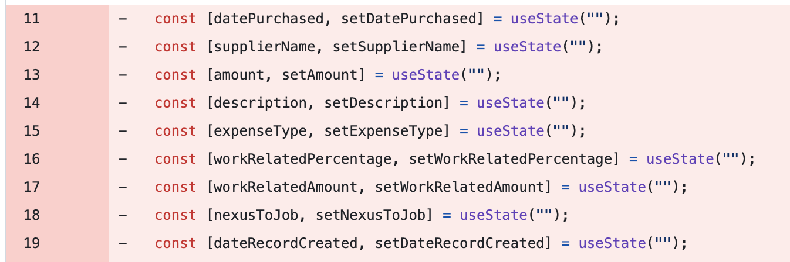
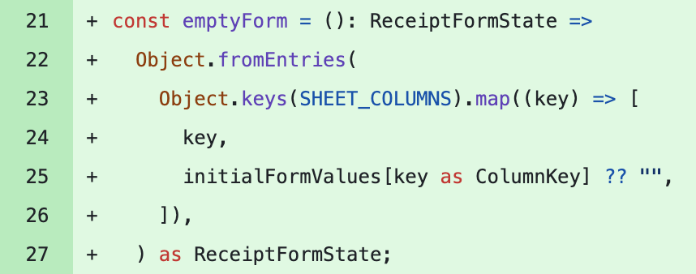

# ATO tax record tool
## Pain point
As an employee, I have certain deductible expenses. To claim them, the ATO requires that I keep a record of the transactions and relevant evidence.
This includes info like date purchased, nexus to work, work related percentage, etc.
If I have a paid subscription that relates to my work, I can claim it as an expense, but it means manual data entry into my google sheets and manually uploading the file to google drive and linking the records correctly.

## Solution
An app that takes a receipt, extracts the fields required by the ATO, uploads the receipt and records the details in Google Sheets with the receipt linked.

# Challenges/Learnings

## Knowledge leak - Receipt form/fields names
### Issue
The fields that are eventually stored in google sheets (amount, description etc) need to be known in various places across the app, and they need to be consistent - the backend expects certain fields to be present/have particular spellings and any discrepancies will cause errors and incorrect records. Changing column names in one place means having to update the names correctly everywhere else.

### Solution
I created types based on a unified record of column names, which led to cleaner code that relied on a single source of truth for column names, and used types to make it much it much safer and easier to make changes/add features.

``` typescript
// Unified constant
export const SHEET_COLUMNS = {
  datePurchased: "Date purchased",
  supplierName: "Supplier name",
  amount: "Amount",
  description: "Description",
  expenseType: "Expense type",
  workRelatedPercentage: "Work-related percentage",
  workRelatedAmount: "Work-related amount",
  nexusToJob: "Nexus to job",
  dateRecordCreated: "Date record created",
  receiptFileUrl: "Receipt file URL",
} as const;
```



